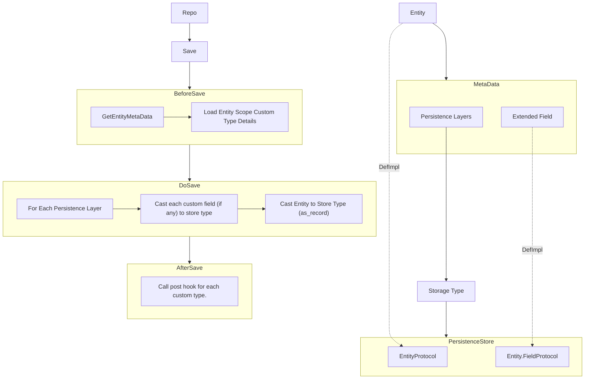

Persistence Stores
====================
# Noizu Labs Entities Store Protocols

## Overview

The Noizu Labs Entities Store Protocols provide a flexible and extensible way to manage CRUD operations across different storage backends. These protocols define how entities are persisted, fetched, and transformed between different formats suitable for various storage mechanisms like Ecto, Amnesia, Redis, and Dummy storage.

## Store Protocols

### What They Are

Store protocols define a set of functions that must be implemented to support CRUD operations for entities in a specific storage backend. Each storage backend has its own protocol that specifies how to handle entities and their fields.

### How They Work

Store protocols work by defining a set of callbacks that must be implemented for each storage backend. These callbacks include functions for persisting entities, transforming entities to and from storage formats, and handling individual fields.

### Defining New Store Protocols

To define a new store protocol, you need to create a new protocol module and implement the required callbacks. Here is an example of how to define a new store protocol:

```elixir
defprotocol Noizu.Entity.Store.NewBackend.EntityProtocol do
  @fallback_to_any true
  def persist(entity, type, settings, context, options)
  def as_record(entity, settings, context, options)
  def fetch_as_entity(entity, settings, context, options)
  def as_entity(entity, record, settings, context, options)
  def delete_record(entity, settings, context, options)
  def from_record(record, settings, context, options)
  def merge_from_record(entity, record, settings, context, options)
end

defimpl Noizu.Entity.Store.NewBackend.EntityProtocol, for: [Any] do
  def persist(entity, type, settings, context, options) do
    # Implement persist logic
  end

  def as_record(entity, settings, context, options) do
    # Implement as_record logic
  end

  def fetch_as_entity(entity, settings, context, options) do
    # Implement fetch_as_entity logic
  end

  def as_entity(entity, record, settings, context, options) do
    # Implement as_entity logic
  end

  def delete_record(entity, settings, context, options) do
    # Implement delete_record logic
  end

  def from_record(record, settings, context, options) do
    # Implement from_record logic
  end

  def merge_from_record(entity, record, settings, context, options) do
    # Implement merge_from_record logic
  end
end
```

## Diagrams

### Relationships Between Repos, Entities, and Stores



## Entity Create Method Walkthrough

### Overview

The `create` method in the entity repository is responsible for creating a new entity. It involves several steps, including invoking general type field meta providers, iterating over storage layers, and preparing fields for insertion into stores.

### Detailed Steps

1. **Invoke General Type Field Meta Providers**: The `create` method first invokes general type field meta providers to handle extended types. These providers can combine multiple data sources into a single view.

2. **Iterate Over Storage Layers**: The method then iterates over the defined storage layers for the entity. For each storage layer, it hooks into the `Entity.ReferenceProtocol` to prepare fields for insertion.

3. **Prepare Fields for Insertion**: Each field is prepared for insertion into the storage backend. For example, a `time_stamp` field in Amnesia might be a struct, but it is unpacked into three `date_time_usec` fields in Ecto.

### Example Code

Here is an example of how the `create` method works:

```elixir
def create(entity, context, options) do
  with repo <- Noizu.Entity.Meta.repo(entity),
       {:ok, entity} <- apply(repo, :__before_create__, [entity, context, options]),
       {:ok, entity} <- apply(repo, :__do_create__, [entity, context, options]),
       {:ok, entity} <- apply(repo, :__after_create__, [entity, context, options]) do
    {:ok, entity}
  end
end

defp __before_create__type({:ok, entity}, context, options) do
  entity =
    Noizu.Entity.Meta.fields(entity)
    |> Enum.map(fn
      {_, Noizu.Entity.Meta.Field.field_settings(type: nil)} -> nil
      {_, Noizu.Entity.Meta.Field.field_settings(type: {:ecto, _})} -> nil
      {field, Noizu.Entity.Meta.Field.field_settings(type: type) = field_settings} ->
        with {:ok, update} <- apply(type, :type__before_create, [get_in(entity, [Access.key(field)]), field_settings, context, options]) do
          {field, update}
        else
          _ -> nil
        end
    end)
    |> Enum.filter(& &1)
    |> Enum.reduce(entity, fn {field, update}, acc -> Map.put(acc, field, update) end)

  {:ok, entity}
end

defp __do_create__(entity, context, options) do
  Noizu.Entity.Meta.persistence(entity)
  |> Enum.map(fn settings ->
    Noizu.Entity.Meta.Persistence.persistence_settings(type: type) = settings
    protocol = Module.concat([type, EntityProtocol])

    with {:ok, record} <- apply(protocol, :as_record, [entity, settings, context, options]) do
      apply(protocol, :persist, [record, :create, settings, context, options])
    end
  end)

  {:ok, entity}
end
```

## Conclusion

The Noizu Labs Entities Store Protocols provide a powerful and flexible way to manage entities across different storage backends. By defining and implementing store protocols, you can easily extend support for new storage mechanisms and ensure consistent handling of entities and their fields.